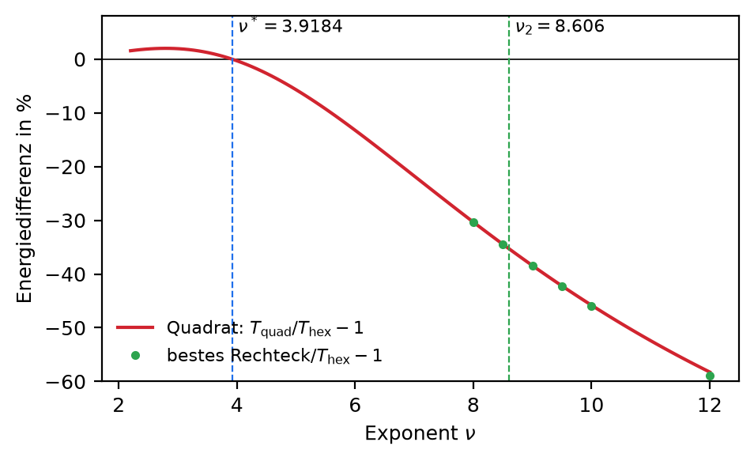
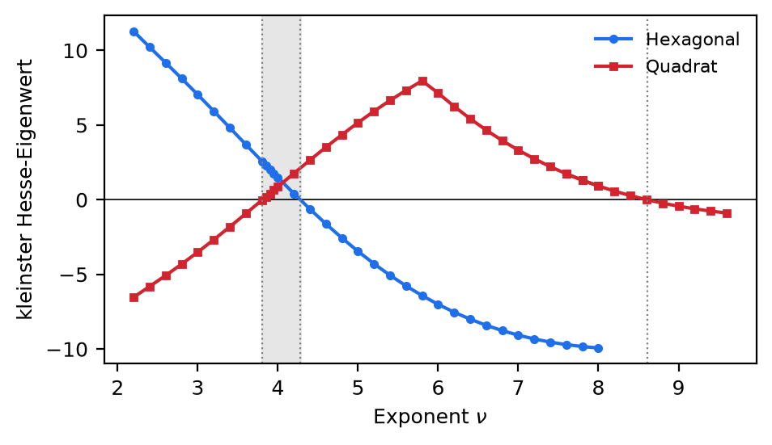
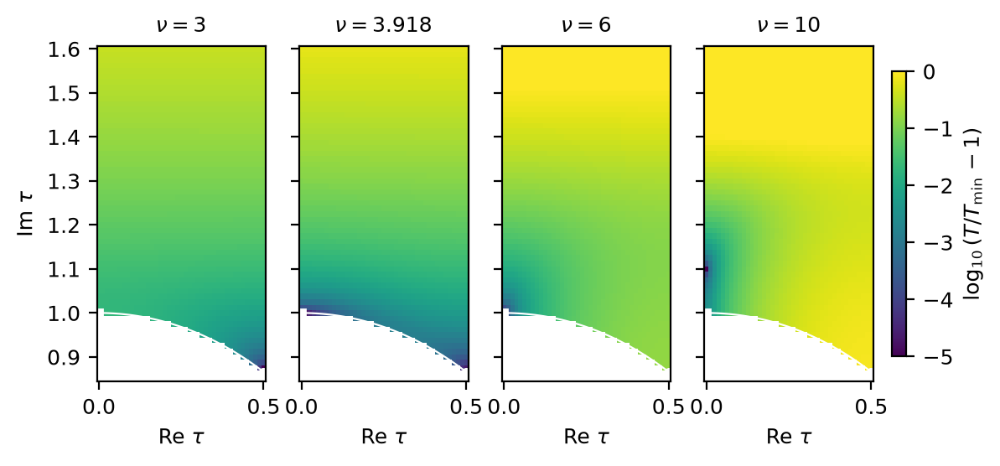

# Dreikörper-Gitterenergie: Sätze, Beweise und Numerik

**Kurzfassung.** Untersucht wird, welches Gitter die reine Dreikörperenergie

T_ν(Λ) = Σ' (|x| · |y| · |x − y|)^{−ν}   (Summe über alle Gitterdreiecke durch den Ursprung)

bei fester Dichte minimiert. Das ist eine **mathematische Modellenergie** und beschreibt kein Material. In 2D ist sie bis auf einen Faktor die modulare Graphfunktion C_{s,s,s}(τ) mit s = ν/2. Die Hauptergebnisse sind zwei **Sätze für den Grenzfall ν → ∞**:
- In 2D laufen die Minimierer gegen ein Rechteckgitter mit Seitenverhältnis √((√17 − 1)/2) ≈ 1,2496. Der Beweis ist vollständig und von Hand.
- In 3D laufen sie gegen BCC. Der Beweis ist computergestützt.

Dazu kommen für endliches ν ein numerisches 2D-Phasendiagramm mit Fehlerbalken (hexagonal → Quadrat → Rechteck) und ein zertifizierter Einschluss des ersten Übergangs. Außerdem gibt es numerische Ergebnisse zu hcp, zu gemischten Energien aus Paar- und Dreikörperterm und zu ungleichen Exponenten.

## 1. Einordnung: Was dieses Dokument behauptet und was nicht

- **Mathematik-Geschichte, nicht Physik-Geschichte.** Echte Dreikörperkräfte (Axilrod–Teller–Muto) haben einen Winkelfaktor und treten immer zusammen mit Paarkräften auf. Aussagen über T_ν gelten nur für diese Modellenergie.
- **Geschenkt ist:** Hexagon und Quadrat sind Fixpunkte der Modulgruppe und deshalb für jede isometrieinvariante Energie kritische Punkte. BCC ist auf dem Bain-Pfad stationär; das ist bekannt (arXiv:2504.07338, Anhang H). Dass T_{2s} = π^{3s} C_{s,s,s} gilt, ist per Konstruktion bekannt (dieselbe Gittersumme).
- **Inhalt haben:** die **globale** Minimalität, die Lage der Übergänge und die beiden Sätze im Limes.
- **Die Summe selbst** ist die „three-body zeta function“ ζ⁽³⁾(ν,ν,ν) aus der Gruppe Buchheit/Schwerdtfeger (arXiv:2504.07338, 2504.11989). Dort wurde sie für einzelne Gitter und entlang des Bain-Pfads ausgewertet, aber nicht über alle Gitter minimiert.

## 2. Ergebnisse auf einen Blick

| Aussage | Status |
|---|---|
| 2D: max. kleinstes Dreiecksprodukt P(Λ) ist P\* = 2((1+√17)/8)^{3/4}, nur für das Rechteck mit Seitenverhältnis √((√17−1)/2) | **bewiesen** (Satz 1) |
| 2D: Minimierer von T_ν → dieses Rechteck für ν → ∞; ebenso das Minimum von C_{s,s,s} für s → ∞ | **bewiesen** (Satz 2) |
| 3D: max. P(Λ) = 3/2, nur für BCC; Minimierer von T_ν → BCC für ν → ∞ | **computergestützt bewiesen** (Satz 3) |
| 2D: Hexagon und Quadrat tauschen bei ν̂ ∈ (3,918364; 3,918366) die Reihenfolge | **zertifiziert** (explizite Fehlerschranken) |
| 2D: global optimal ist hexagonal für 4/3 < ν < 3,91836, Quadrat bis ν₂ = 8,6063 ± 0,0005, danach Rechteck | numerisch, mit Fehlerbalken (Vermutung) |
| 2D: beide Gitter lokal stabil für 3,80632 < ν < 4,27848 (Übergang erster Ordnung) | numerisch, Fehler ≤ 6·10⁻⁵ |
| 3D: BCC bestes Gitter für alle getesteten ν von 2,2 bis 16 | numerisch (globale Suche bzw. Vergleich) |
| 3D: FCC wird entlang des Bain-Pfads instabil bei ν_c = 3,7521 ± 0,0001 | numerisch, mit Fehlerbalken |
| 3D: hcp (optimales c/a) liegt stets knapp über FCC | numerisch |
| Paar + λ · Dreikörper: in 3D Sprung FCC → BCC bei λ_c(ν), in 2D hexagonal → Quadrat | numerisch |

## 3. Satz 1 und 2: der Grenzfall ν → ∞ in 2D

Für ein Gitter Λ sei P(Λ) das kleinste Produkt der drei gegenseitigen Abstände unter allen Tripeln verschiedener Gitterpunkte. Kollineare Tripel zählen mit. Sei a\* = ((1+√17)/8)^{1/4} ≈ 0,894563, P\* = 2a\*³ ≈ 1,431734 und Λ\* das Rechteckgitter mit Seiten a\* und 1/a\*.

**Satz 1.** Für jedes 2D-Gitter mit Kovolumen 1 gilt P(Λ) ≤ P\*, mit Gleichheit genau für Λ\* (bis auf Isometrie).

**Beweis.**
1. Jedes Gitter hat nach Drehung und Spiegelung eine reduzierte Basis u = (a, 0), v = (p, 1/a) mit a = kürzeste Vektorlänge, 0 ≤ p ≤ a/2. Es gilt a⁴ ≤ 4/3 (Hermite-Konstante).
2. Das kollineare Tripel (0, u, 2u) hat Produkt 2a³.
3. Das Tripel (0, u, v) hat Produkt π mit π² = a²(p² + k)((a−p)² + k), wobei k = a^{−2}. Mit m = p(a − p) ∈ [0, a²/4] folgt (p²+k)((a−p)²+k) = (ka² + k²) + m(m − 2k). Wegen m ≤ a²/4 < 2k ist der letzte Summand ≤ 0, mit Gleichheit nur für p = 0. Also π ≤ √(a² + a^{−2}), mit Gleichheit nur beim Rechteck.
4. Somit P(Λ) ≤ G(a) := min(2a³, √(a² + a^{−2})). Der erste Term wächst in a, der zweite fällt auf (0, 1]. Sie schneiden sich genau bei 4a⁸ = a⁴ + 1, also a = a\*. Für 1 ≤ a ≤ (4/3)^{1/4} ist a² + a^{−2} ≤ 7/(2√3), und das liegt unter P\*². Daher ist G(a) ≤ P\* mit Gleichheit nur für a = a\*. Mit Schritt 3 folgt Gleichheit in Satz 1 nur für a = a\* und p = 0, also für Λ\*.
5. Umgekehrt ist P(Λ\*) = P\*:
   - Kollineare Tripel haben ein Produkt von mindestens 2s³ ≥ 2a\*³, weil der Punktabstand s auf einer Gittergeraden mindestens a\* ist.
   - Ein nicht-kollineares Dreieck hat Fläche ≥ 1/2. Für die beiden kürzeren Seiten d₁, d₂ gilt daher d₁d₂ ≥ 1, also Produkt ≥ längste Seite d₃.
   - Gittervektoren kürzer als D = √(a\*² + a\*^{−2}) sind nur ±u und ±v. Sie spannen nur zwei Richtungen auf, die drei Seiten eines Dreiecks aber drei paarweise unabhängige. Also ist d₃ ≥ D = P\*. ∎

**Satz 2.** Für jedes ν > 4/3 hat T_ν Minimierer. Jede Familie von Minimierern konvergiert für ν → ∞ gegen Λ\*, und (min T_ν)^{1/ν} → 1/P\*. Für die modulare Graphfunktion bedeutet das: Die Minimalstellen von C_{s,s,s} auf der Fundamentaldomäne konvergieren für s → ∞ gegen τ = i·√((√17−1)/2).

**Beweisidee.**
- T_ν(Λ) ≥ P(Λ)^{−ν}, denn das kleinste Dreieck kommt in der Summe vor.
- T_ν(Λ\*) ≤ C · P\*^{−ν}.
- Daraus folgt P(Λ_ν) ≥ C^{−1/ν} P\* → P\*.
- Mit Mahlers Kompaktheitssatz und Satz 1 konvergiert Λ_ν gegen Λ\*. ∎

Beide Sätze wurden numerisch gegengeprüft (`research/theorem/check_maxmin_2d.py`):
- 20.000 Zufallsgitter verletzen die Schranke aus Schritt 4 nie.
- Das numerische Maximum von P über die Fundamentaldomäne liegt bei τ ≈ 1,2475i.
- Die berechneten Optima für endliches ν nähern sich monoton dem Grenzwert: 1,056 (ν=9), 1,100 (10), 1,141 (12), 1,170 (15), 1,194 (20), 1,215 (30).

## 4. Satz 3: der Grenzfall ν → ∞ in 3D (computergestützt)

**Satz 3.** Für jedes 3D-Gitter mit Kovolumen 1 gilt P(Λ) ≤ 3/2, mit Gleichheit genau für BCC. Folglich konvergieren die Minimierer von T_ν (ν > 2) für ν → ∞ gegen BCC.

Zum Vergleich: P(FCC) = P(SC) = P(hcp) = √2 ≈ 1,414.

**Beweisaufbau.** Es sei Q(G) = P/√det G mit der Gram-Matrix G und G₁₁ = 1. Die übrigen fünf Einträge sind die Parameter.
1. **Kompakter Suchbereich (von Hand bewiesen).**
   - Jedes Gitter hat eine Minkowski-reduzierte Gram-Matrix in einem expliziten Bereich 𝓡.
   - Auf 𝓡 gilt det G ≥ g₂₂g₃₃/4. Das folgt aus dem Umkreisradius des spitzen Basisdreiecks und der Voronoi-Eigenschaft von b₃.
   - Mit dem kollinearen Tripel folgt Q < 3/2, sobald g₂₂g₃₃ > 64/9. Übrig bleibt eine kompakte Box.
   - BCC hat in 𝓡 genau einen Vertreter q₀ = (1, 1, 1/3, 1/3, −1/3).
2. **Lokales Lemma (Intervallarithmetik).**
   - An q₀ sind 36 Dreiecke aktiv, mit 6 verschiedenen Gradienten. Deren konvexe Hülle enthält den Ursprung mit Abstand c = 0,13887.
   - Jede Verformung senkt also mindestens eines dieser Dreiecke linear.
   - Auf der Box q₀ ± 0,007 gilt streng ‖Hess f_t‖ ≤ 14,92.
   - Daraus folgt Q < 3/2 in der ganzen Box außer in q₀.
3. **Branch-and-Bound über den Rest.**
   - Auf jeder Teilbox wird Q nach oben abgeschätzt, durch Maxima der (linearen) quadrierten Seitenlängen und ein Minimum der Determinante.
   - Nach 9,93 Millionen Boxen ist **jede Box zertifiziert**: überall Q < 3/2.

**Status.** Das lokale Lemma ist streng, weil es mit Intervallarithmetik gerechnet ist. Der Branch-and-Bound rechnet in doppelter Genauigkeit mit Sicherheitsmargen (10⁻⁹ relativ, 10⁻¹² absolut). Diese übersteigen die Rundungsfehler der wenigen Rechenschritte pro Schranke um Größenordnungen. Ein vollständiger Neulauf in Intervallarithmetik ist möglich und steht noch aus. Kontrollen (`research/theorem3d/test_prover.py`):
- In 1200 Stichproben lagen die Box-Schranken nie unter dem echten Wert.
- Mit dem falschen Ziel 1,49 scheitert der Beweiser wie erwartet.

## 5. Endliches ν in 2D (Numerik mit Fehlerangaben)

Die Rechnungen verwenden eine eigene Referenzsumme ohne GZL-Code. Die Übereinstimmung mit GZL liegt bei 55 Testfällen unter 2·10⁻¹⁰, und die Werte bei ν = 3 stimmen mit arXiv:2504.07338 überein.

- **4/3 < ν < 3,91836: hexagonal.**
  - Bei ν = 2 ist das exakt, weil T₂ = π³(E₃ + ζ(3)) und die Epstein-Zeta ihr Minimum beim Hexagon hat.
  - Für 1,4 ≤ ν ≤ 1,9 ist das Hexagon unter den Kandidaten am tiefsten, stabil auf 10⁻⁸. Dafür war ein Hochrechnungsansatz mit zwei Exponentenfamilien nötig.
- **Übergang bei ν\*:** Der Wechsel von hexagonal zu Quadrat ist zertifiziert in (3,918364; 3,918366).
  - Dafür wurde die abgeschnittene Summe direkt gefaltet, ohne FFT.
  - Der Rest ist explizit abgeschätzt, und für Rundung gibt es eine Marge (`research/theorem/certify_nustar.py`).
- **Erste Ordnung:** Das Quadrat ist lokal stabil ab 3,80632, das Hexagon bis 4,27848. Bei ν\* liegt auf dem Bogen |τ| = 1 eine Barriere von 0,14 %.
- **ν₂ = 8,6063 ± 0,0005:** Dort wird das Quadrat in Streckrichtung instabil. Danach ist das Optimum ein Rechteck, dessen Seitenverhältnis gegen 1,2496 wächst (Satz 2).

{width=100%}

**Vermutung.** In 2D ist der Minimierer hexagonal für 4/3 < ν < ν\*, quadratisch für ν\* < ν ≤ ν₂ und rechteckig mit wachsendem Seitenverhältnis für ν > ν₂.

## 6. Endliches ν in 3D (Numerik)

- **Globale Suche über alle Bravais-Gitter:** 67 Starts pro ν, siehe `research/extended/`. Ergebnisse in Abschnitt 9.
- **Kleine ν (2,2 bis 2,8):** BCC < FCC < SC, stabil über zwei Abschneide-Sätze.
- **FCC-Instabilität:** Die Krümmung entlang des Bain-Pfads wechselt bei ν_c = 3,7521 ± 0,0001 das Vorzeichen. Der Fehlerbalken ist die Streuung über drei Schrittweiten und zwei Abschneide-Sätze. Die instabile Richtung zeigt zu BCC.
- **hcp:** Über c/a ∈ [1,45; 1,85] optimiert liegt hcp bei allen getesteten ν knapp über FCC, zum Beispiel 17,9724 gegenüber 17,9624 bei ν = 4,5, mit BCC bei 17,7406.

## 7. Gemischte Energien: Paar- plus Dreikörperterm

E_λ = Z_ν + λ · T_ν mit der Paarenergie Z_ν = Σ'|x|^{−ν} (gleicher Abfall pro Bindung) bei fester Dichte. Z_ν wurde exakt mit epsteinlib berechnet.

| ν | 3D: λ_c (FCC → BCC) | 2D: λ_c (hexagonal → Quadrat) |
|---|---|---|
| 3,0 | – | kein Übergang (Hexagon für alle λ) |
| 3,5 | 0,049 | – |
| 4,5 | 0,065 | 1,861 |
| 6,0 | 0,103 | 1,044 |
| 9,0 | 0,289 | 1,507 (Rechteck ab λ ≈ 200) |

- In 3D springt das Optimum unter den Kandidaten direkt von FCC zu BCC; **hcp ist nie optimal**.
- In 2D gab es auf dem Gitter der Fundamentaldomäne kein Zwischengitter.
- Die Kandidatenmenge in 3D ist FCC, BCC, hcp(c/a) und die Bain-Familie. Eine globale Suche für gemischte Energien steht noch aus.

## 8. Ungleiche Exponenten C_{a,a,b}

Gesucht wurde der globale Minimierer von Σ' |x|^{−ν}|y|^{−ν}|x−y|^{−μ} über der ganzen Fundamentaldomäne, auf einem Gitter ν, μ ∈ [2,5; 12]. Das ist bis auf Normierung C_{ν/2, ν/2, μ/2}. Ergebnisse und Phasenkarte stehen in Abschnitt 9.

## 9. Ergänzende Läufe

ERGAENZUNG_PLATZHALTER

## 10. Neuheit

Drei Literaturprüfungen liefen über KI-Agenten: nach Stichworten, als Volltextsuche und Autor für Autor (Bétermin, Petrache, Faulhuber, Stefanelli/Friedrich/Kreutz, Luo–Wei, Cohn, Bilyk, Buchheit/Schwerdtfeger). Keine fand die Sätze 1–3 oder das Phasendiagramm. Am nächsten liegen:
- **arXiv:2504.07338:** dieselbe Summe, aber nur bei ν = 3 und nur auf dem Bain-Pfad.
- **arXiv:2107.14020:** dieselbe Beweistechnik für große Exponenten, aber für Paarenergien.
- **arXiv:2303.12283 (Bilyk u. a.):** Dreipunkt-Max-Min-Probleme auf der Sphäre, nicht auf Gittern.

Die Einschätzung der Agenten ist 85–90 % für Satz 1/2 und etwa 65 % für die 3D-Aussagen. Eine Garantie ist das nicht; Google Scholar war nicht erreichbar. Das **Risiko, dass jemand zuvorkommt, ist hoch**, weil die Gruppe Buchheit/Schwerdtfeger an Mehrkörper-Stabilität arbeitet.

## 11. Grenzen und nächste Schritte

- Für endliches ν gibt es **keinen Satz** außer dem zertifizierten Einschluss von ν\*. Ein Beweis, dass C_{2,2,2}, C_{3,3,3} und C_{4,4,4} ihr Minimum bei τ = i haben, wäre der nächste echte Schritt. Das ginge etwa über einen Branch-and-Bound wie in 3D, dann mit Fehlerschranken für die unendlichen Summen.
- Der Branch-and-Bound in 3D sollte noch vollständig in Intervallarithmetik laufen.
- Die physikalisch relevante Frage mit Winkelfaktor (ATM) ist nicht behandelt.

## 12. Reproduzierbarkeit

Alle Pfade sind relativ zum Repository:
- `research/verification/`: Referenzsumme und Nachprüfung
- `research/theorem/`: 2D-Satz und zertifiziertes ν\*
- `research/theorem3d/`: lokales Lemma, Branch-and-Bound und Tests
- `research/extended/`: 3D-Suche, Fehlerbalken, hcp, gemischte Energien, ungleiche Exponenten, kleine ν
- `research/note/`: englische Note mit allen Beweisen
